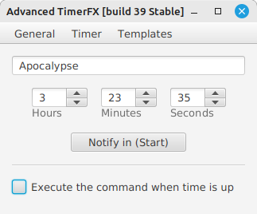

# Advanced TimerFX



### It is a free, open-source timer with some useful features, such as shut down and reboot when time is up.

Features:
* Operation:
  * Shut down
  * Reboot
  * Suspend
  * Log out
  * Custom command
  * Kill The Process with defined PID
* Hot keys support
* Multilanguage (English, Ukrainian and Russian)

System Requirements:
* OS: Windows or Linux
* [Java Runtime Environment](https://java.com/en/download/manual.jsp) version 8 (or newer)


*** [Download](https://github.com/YALdysse/Advanced_TimerFX/releases)


## Building from Source

To build project with Maven you need have installed JDK v11.0.9 (or higher) and Apache Maven v3.8.1 (or higher).

Open terminal in folder with project and execute the command:
```
mvn package
```

Then you will find compiled source code in folder './target/classes/' and .jar file -  './target/'
